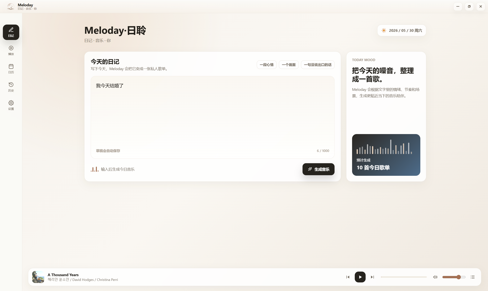
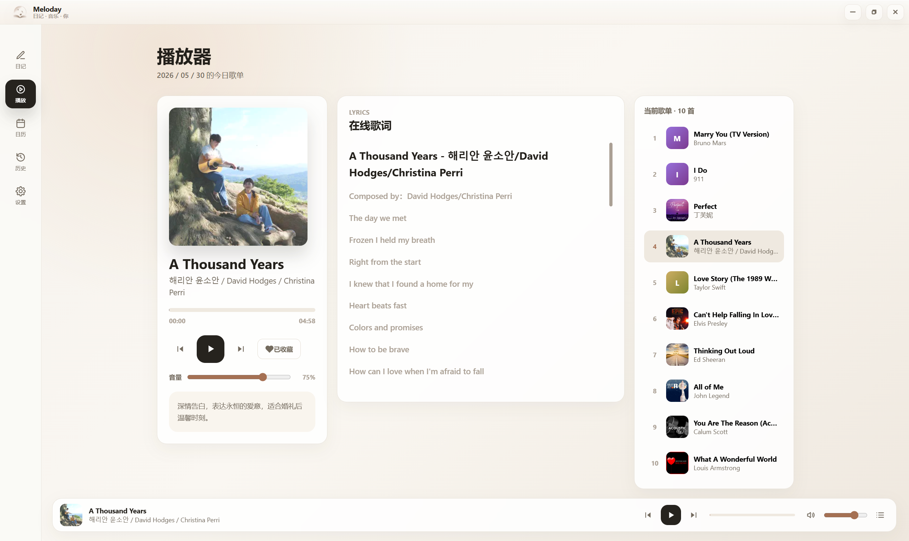
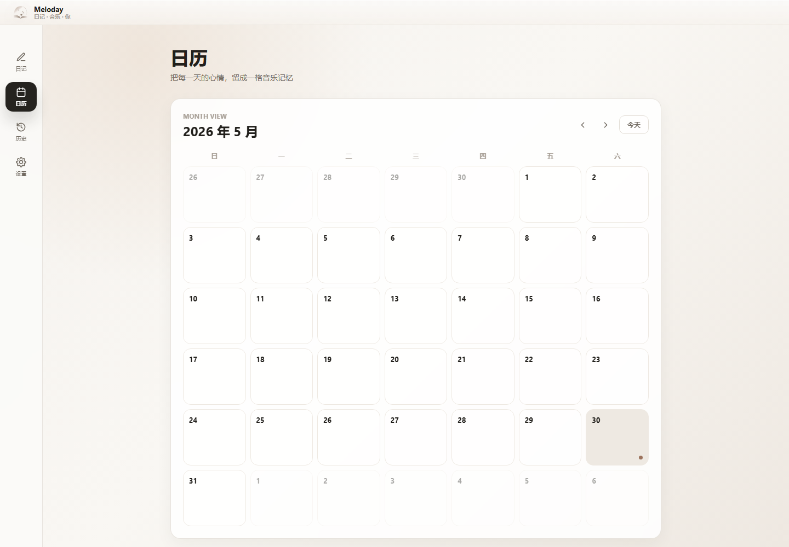
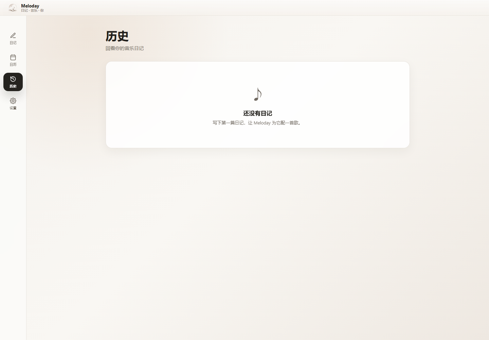
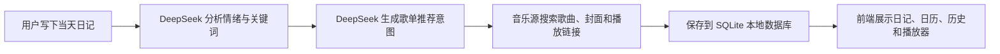
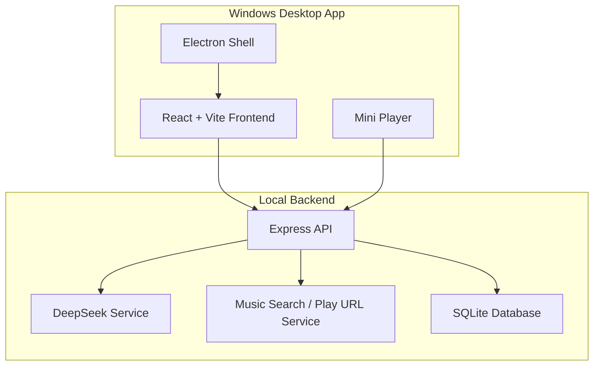

# Meloday / 日聆

> 写下一天，让 AI 替你挑一张属于今天的歌单。

Meloday（日聆）是一款面向 Windows 的 AI 音乐日记应用。它把“写日记”变成一个更轻的音乐仪式：你只需要记录今天发生了什么、心情如何，Meloday 会分析文字里的情绪、场景和节奏，再为这一天生成一张私人歌单。

它不是传统播放器，也不是单纯的日记本。Meloday 更像一个把文字、情绪、日历和音乐放在一起的桌面小空间：今天写下来的东西，会和当天的歌单一起被保存，之后可以在日历和历史记录里重新打开。

[下载最新 Windows 便携版](https://github.com/cpc1513/Meloday/releases/latest)

## 应用截图

### 写下今天，生成今日音乐



### 在播放器中预览歌词，歌单，收藏今天



### 用日历回看每天的情绪和音乐



### 在历史里找回过去的日记




## Meloday 能做什么

- **AI 音乐日记**：输入一段日记，应用会根据文字内容生成当日歌单。
- **情绪理解**：后端通过 DeepSeek 分析日记里的情绪、关键词和场景，新用户有365次免费生成次数，后续可以选择添加自己的apikey
- **音乐推荐**：把 AI 生成的推荐意图转成可搜索的歌曲候选，再匹配在线音乐数据。
- **日历归档**：每天的日记、情绪和歌单会以日期为单位保存，适合长期回看。
- **历史记录**：用时间线方式回顾过去写过的内容和生成过的音乐。
- **迷你播放器**：在应用底部保留轻量播放入口，不打断写作和浏览。
- **本地优先**：日记和歌单数据保存在本机 SQLite 数据库中。
- **Windows 便携版**：发布包为 `Meloday-Portable-*.exe`，无需安装即可运行。

## 工作原理

Meloday 的核心流程很简单：文字进入，情绪和歌单出来，然后被保存成当天的音乐记忆。



更具体一点：

1. 用户在日记页输入当天的文字。
2. 前端把日记内容发送给本地后端服务。
3. 后端调用 DeepSeek，把日记整理成情绪标签、关键词和推荐方向。
4. 后端根据推荐方向搜索歌曲，并补全歌名、歌手、专辑封面和播放信息。
5. 日记、情绪和歌单写入本地 SQLite 数据库。
6. React + Electron 前端把这些内容呈现在日记页、日历页、历史页和播放器中。

## 技术架构



| 模块 | 技术 |
|---|---|
| 桌面容器 | Electron |
| 前端 | React, Vite, TypeScript |
| 后端 | Express, TypeScript |
| 数据库 | SQLite |
| AI 能力 | DeepSeek API |
| 音乐数据 | 在线音乐源接口 |
| 打包 | electron-builder portable Windows target |

## 下载和使用

1. 打开 [GitHub Releases](https://github.com/cpc1513/Meloday/releases/latest)。
2. 下载最新的 `Meloday-Portable-*.exe`。
3. 双击运行，无需安装。

注意：当前应用尚未购买代码签名证书，所以 Windows 可能会显示 “Unknown publisher” 或 SmartScreen 提示。这不代表文件一定有问题，只是说明它还没有经过商业证书签名。

## 本地开发

### 环境要求

- Node.js 20+
- npm
- DeepSeek API Key

### 安装依赖

```bash
cd backend
npm install

cd ../frontend
npm install
```

### 配置后端

复制环境变量模板：

```bash
cd backend
copy .env.example .env
```

编辑 `backend/.env`：

```env
DEEPSEEK_API_KEY=your_api_key
PORT=3000
DATABASE_PATH=
```

如果 `DATABASE_PATH` 留空，后端会默认使用项目目录下的 `data/meloday.db`。

### 启动开发环境

启动后端：

```bash
cd backend
npm run dev
```

启动前端：

```bash
cd frontend
npm run dev
```

启动 Electron 开发模式：

```bash
cd backend
npm run build

cd ../frontend
npm run electron:dev
```

## 构建 Windows 便携版

```bash
cd backend
npm run build

cd ../frontend
npm run build
npm run dist
```

构建产物会输出到 `release/` 目录。该目录不会提交到 Git，正式分发请使用 GitHub Releases。

如果 `electron-builder` 下载 NSIS 资源失败，可以临时使用镜像：

```powershell
$env:ELECTRON_BUILDER_BINARIES_MIRROR='https://npmmirror.com/mirrors/electron-builder-binaries/'
cd frontend
npx electron-builder
```

## API 概览

| 方法 | 路径 | 说明 |
|---|---|---|
| `GET` | `/api/health` | 检查后端服务状态 |
| `POST` | `/api/entries` | 创建当天日记并生成歌单 |
| `GET` | `/api/entries/recent` | 获取最近日记 |
| `GET` | `/api/entries/:date` | 按日期读取日记 |
| `GET` | `/api/calendar?year=2026&month=5` | 获取日历数据 |
| `GET` | `/api/songs/:songId/play-url` | 获取歌曲播放链接 |

## 项目结构

```text
.
├── backend/          # Express + SQLite API
├── frontend/         # React + Vite + Electron app
├── data/             # 本地运行数据库，已被 git 忽略
├── docs/             # 产品说明、设计文档和截图
├── release/          # 本地打包输出，已被 git 忽略
└── release-final/    # 本地打包输出，已被 git 忽略
```

## 说明

- Meloday 是个人项目，目前更适合个人学习、体验和继续迭代。
- 音乐播放能力依赖在线音乐源，歌曲可用性可能因版权、地区或接口变化而变化。
- `.env`、本地数据库、构建产物和打包后的 exe 不会提交到仓库。
- 如果你想体验完整生成流程，需要可用的 DeepSeek API 配置。

## License

Personal project. Please respect the terms and copyright rules of the services you connect to.
